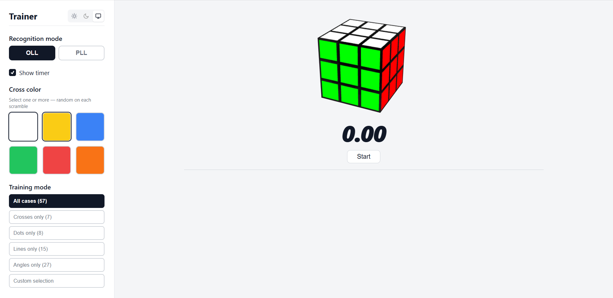
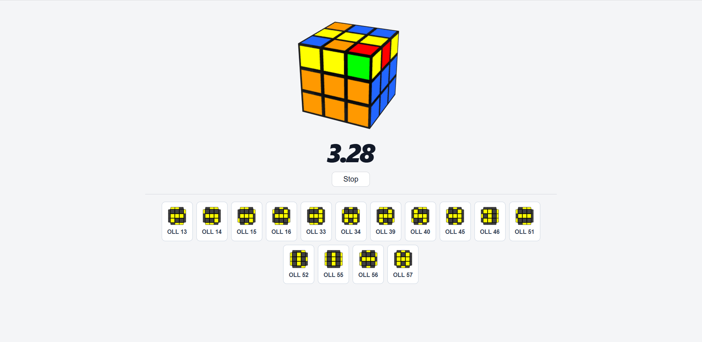
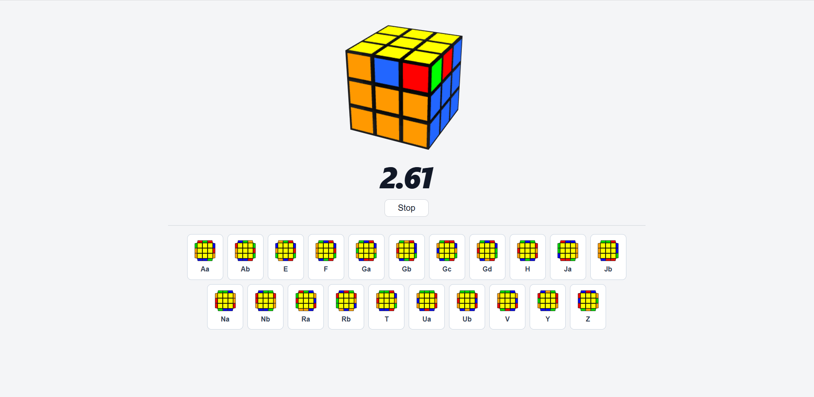

# 2 Sided OLL and PLL Recognition

A web application designed for speedcubers to practice recognizing OLL and PLL situations using only two visible sides of the Rubik's Cube.
This simulator was created because I have not found two-way OLL recognition anywhere.

---

## Screenshots

### Main Screen

### OLL Training Mode

### PLL Training Mode

---

## How to Run

This project is built using pure HTML, CSS, and vanilla JavaScript without any frameworks or build tools. 

To run the application locally:
1. Clone the repository.
2. Open the `index.html` file directly in any modern web browser.